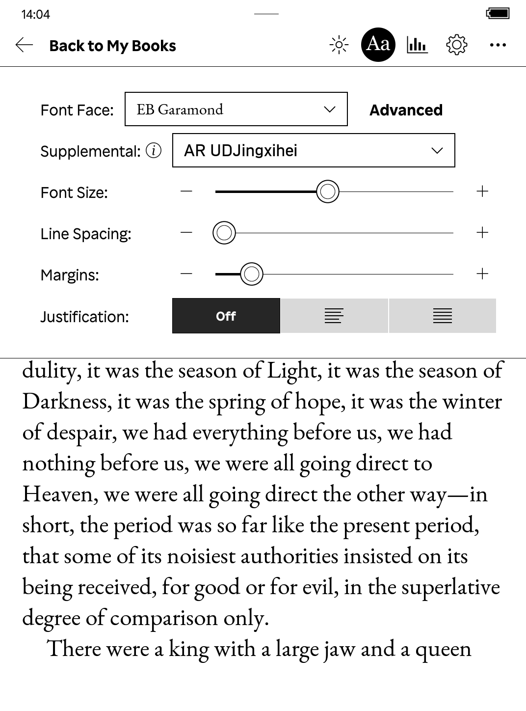
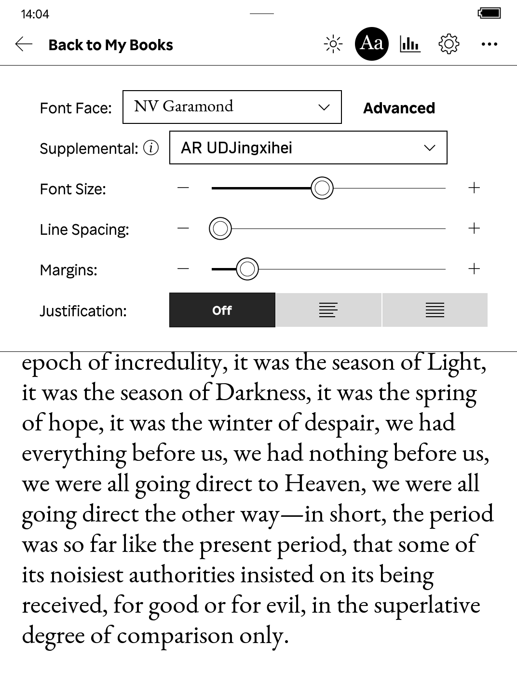
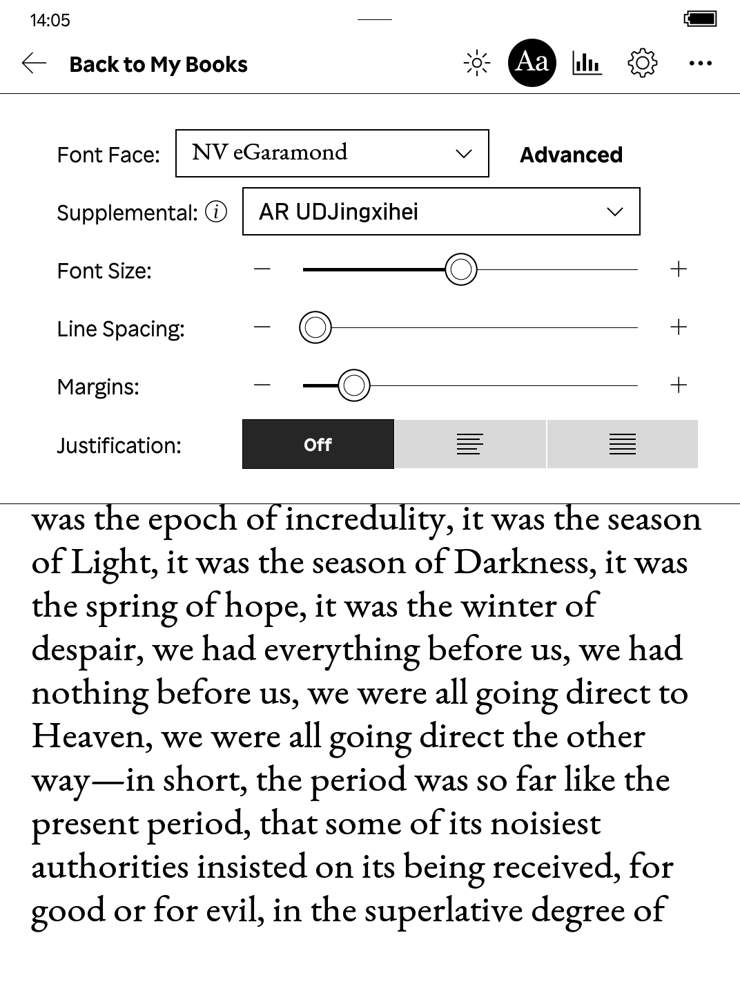

## What is this?

NV Garamond is an [EB Garamond](https://github.com/georgd/EB-Garamond) variant, with adjusted metrics and a 10% glyph size increase. This makes it ideal for digital reading on e-readers.

It serves a similar purpose to [EB Garamond Absinthe](https://www.mobileread.com/forums/showpost.php?p=3739272&postcount=404) as found on the MobileRead Forums, but other than some resized glyphs and adjusted metrics it does not contain any other alterations (default number symbols remain, for example).

## Comparison

## How was this made?

Using [FontForge](https://fontforge.org/en-US/). You too can learn how to [scale glyphs](https://www.fonttutorials.com/how-to-scale-glyphs/), [adjust metrics](http://designwithfontforge.com/en-US/Line_Spacing.html) and [generate a font](https://www.fonttutorials.com/how-to-fix-font-abg-thumbnails/#generating-your-font).

I've included the FontForge files in this repository.

## Versions

There are two versions included in the repo:

- **NV Garamond (preferred)**: Best on Kobo. With adjusted metrics and a minor size bump. Because this one starts thinner and at a tight line spacing, you have more control over the precise weight and line spacing on Kobo devices.
- **NV eGaramond**: The same as above, but with a 10% bump to the regular and italic weights for better contrast on e-ink displays. Due to the weight bump, appears a bit wider (which is not my personal preference) but I've included this version as an alternative if you think the original is too thin.

## License

As the original font, it is licensed under the permissive [SIL Open Font License](https://en.wikipedia.org/wiki/SIL_Open_Font_License).